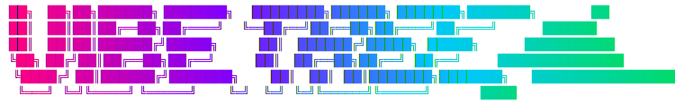

<p align="center">
  
</p>

<p align="center"><strong>Multi-agent Claude Code orchestrator with TUI dashboard.</strong></p>

Vibe manages parallel Claude Code sessions inside tmux. Each session gets its own git worktree and tmux window so multiple Claude instances can work on the same repo simultaneously without conflicts. A terminal dashboard provides real-time monitoring, agent spawning, and session switching.

## Requirements

- Rust 1.82+
- [tmux](https://github.com/tmux/tmux)
- [Claude Code CLI](https://docs.anthropic.com/en/docs/claude-code) (`claude`)
- Git

## Installation

```sh
cargo install --path .
```

## Quick Start

```sh
cd my-repo
vibe init
vibe            # opens TUI dashboard
```

From the dashboard, press `n` to create a session, `Enter` to open it, and the configured hotkey (default F16) to return to the dashboard.

## Commands

| Command | Description |
|---------|-------------|
| `vibe` | Launch TUI dashboard (default) |
| `vibe init` | Initialize workspace (single-repo or multi-repo) |
| `vibe new <name>` | Create session with worktree, tmux window, and Claude |
| `vibe spawn <prompt>` | Spawn a sub-agent within an existing session |
| `vibe status [--json]` | Show status of all sessions and agents |
| `vibe list sessions\|agents\|templates\|plans` | List resources |
| `vibe kill <target> [-f] [--delete-branch]` | Kill a session or agent |
| `vibe attach [session]` | Attach to a session's tmux pane |
| `vibe review <pr> [--interactive]` | Spawn a PR review agent |
| `vibe plan new\|list\|view\|copy` | Manage shared plan documents |
| `vibe doctor` | Check workspace health and reconcile state |
| `vibe cleanup [--all] [--dry-run]` | Remove stale worktrees and archived sessions |
| `vibe refresh-repos` | Re-scan directory for added/removed repos (multi-repo) |

### Session Creation

```sh
vibe new my-feature                     # branch: feat/my-feature
vibe new my-feature --branch fix/bug    # custom branch
vibe new my-feature --template planner  # use a template
vibe new my-feature --headless -p "implement login" # headless with prompt
```

### Agent Spawning

```sh
vibe spawn "write tests for auth module" --session my-feature
vibe spawn "review the PR" --template reviewer
```

## TUI Controls

| Key | Action |
|-----|--------|
| `j` / `k` / arrows | Navigate lists |
| `Enter` | Open session or view agent output |
| `n` | Create new session |
| `s` | Spawn agent (opens template picker) |
| `Backspace` | Kill session/agent (with confirmation) |
| `Tab` | Switch focus between session list and agent list |
| `c` | Copy agent output to clipboard |
| `r` | Refresh state |
| `Esc` | Back navigation |
| `q` | Quit |
| F16 (configurable) | Return to dashboard from any session window |
| F19 (configurable) | Session overview (tiled live previews) |
| `Prefix+d` / `Prefix+o` | Fallback dashboard/overview (always works) |

## Configuration

### Global: `~/.config/vibe/config.toml`

```toml
tmux_session_prefix = "vibe-"       # tmux session name prefix
worktree_suffix = "-vibe-"          # worktree directory suffix
claude_command = "claude"            # claude binary (supports env prefixes, custom paths)
claude_extra_args = []              # extra args passed to claude CLI
template_dirs = []                  # additional template search paths
clipboard_on_complete = true        # copy agent output on completion
notify_on_complete = true           # OS notification on agent completion
max_concurrent_agents = null        # optional concurrency limit
dashboard_key = "[29~"              # CSI suffix for dashboard hotkey (F16)
overview_key = "[33~"               # CSI suffix for overview hotkey (F19)
```

### Workspace: `.vibe/config.toml`

```toml
claude_command = "ENV=val claude"    # override claude command for this project
worktree_base_dir = "/path/to/base" # where worktrees are created
default_branch = "main"             # base branch for new sessions
template_dir = "./templates"        # project-specific templates
pre_session_hook = "make setup"     # run before session creation
post_session_hook = "make clean"    # run after session teardown
```

## Templates

Templates are markdown files with TOML frontmatter that define agent behavior. Place them in `.vibe/templates/` (workspace) or `~/.config/vibe/templates/` (global).

```markdown
+++
description = "Architecture planning agent"
mode = "headless"
permission_mode = "plan"
allowed_tools = ["Read", "Grep", "Glob"]
disallowed_tools = ["Edit", "Write"]
+++

You are a planning agent. Analyze the codebase and produce
a detailed implementation plan.
```

### Built-in Templates

| Template | Mode | Description |
|----------|------|-------------|
| planner | headless | Architecture planning, read-only analysis |
| implementer | interactive | Feature implementation with full access |
| reviewer | headless | Code review, read-only with git/gh access |
| tester | headless | Test suite generation |
| refactorer | headless | Code structure improvement |

Claude Code project agents (`.claude/agents/*.md`) are also available in the template picker.

## Multi-Repo Workspaces

Vibe supports parent directories containing multiple git repositories. Each session creates worktrees in all repos with a shared branch name, mirroring the parent directory layout.

```sh
cd my-platform/          # contains api/, web/, shared/
vibe init                # "Discovered 3 repositories: api, web, shared"
vibe new onboarding      # creates worktrees in all 3 repos
```

The session root mirrors the parent layout so Claude sees the same directory structure:

```
my-platform-vibe-abc123/
  api/                   # worktree of my-platform/api (branch: feat/onboarding)
  web/                   # worktree of my-platform/web (branch: feat/onboarding)
  shared/                # worktree of my-platform/shared (branch: feat/onboarding)
```

Use `vibe refresh-repos` to pick up newly added or removed repositories.

## Architecture

```
src/
  cli.rs          Command definitions (clap)
  config.rs       Global and workspace configuration
  main.rs         Entry point and command dispatch
  commands/       Command implementations (init, new, spawn, kill, etc.)
  domain/         Core entities (Session, Agent, Workspace, Template, Plan)
  infra/          Infrastructure (tmux, git, claude CLI, state persistence)
  tui/            Terminal UI (ratatui dashboard, widgets, event loop)
```

State is persisted in `.vibe/workspace.json`. Agent output is written to `.vibe/agents/`. Plans are stored in `.vibe/plans/`.

## License

MIT
